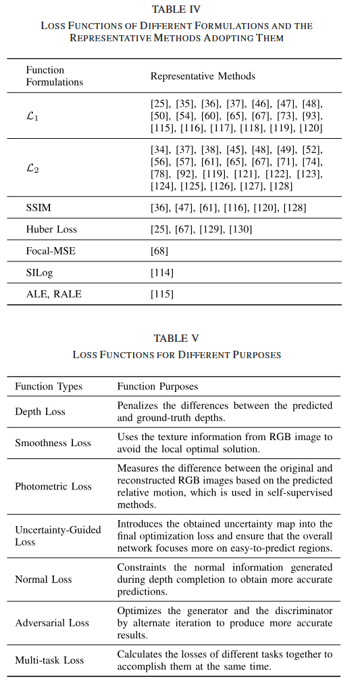
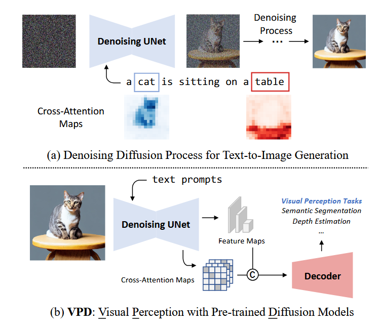
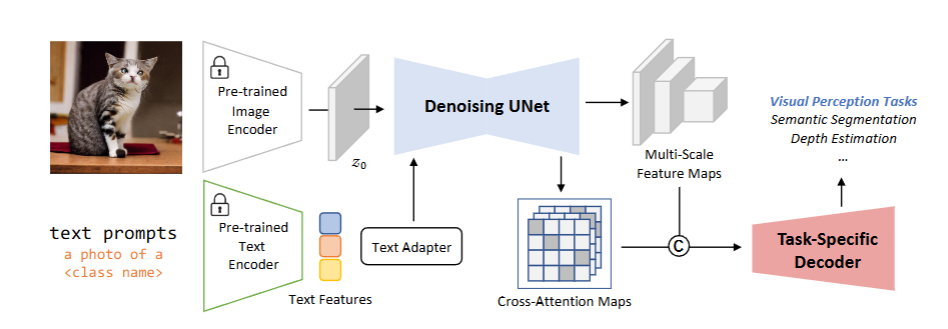
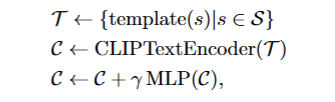

## Date
2026.4.13

### Daily Summary
1. 写完loss functions部分并进行修改，参考了一篇Survey的分类
 

## Date
4.14-4.15

### Daily Summary
1. 先对DepthFM的输出用最小二乘法对齐，然后去可视化全局尺度是否一致，结果是大部分不一致（和Any2Full中的结论相同）
2. 修改之前的方法，输入改为 [relative_depth, sparse_depth, sparse_minus_relative_on_valid] 的三通道，完善encoder、cross attention和decoder的实现，修改loss，再跑一遍观察效果，和之前的结果差不多
3. 看了一下VPD论文
 
（1）研究背景  
- 文生图扩散模型经大规模图文对预训练，具备丰富高层语义与低层视觉知识，但未被充分用于视觉感知任务  
- 传统视觉预训练与扩散模型存在流程不兼容、架构差异两大迁移难题
（2）Overall Framework  
 
- Prompting Text-to-Image Diffusion Model：CLIP对文本进行编码，采用由两层MLP实现的文本适配器来精调CLIP编码得到的文本特征；根据输入图像与条件输入提取多尺度特征，设置t=0，即不对隐特征图添加任何噪声；轻量化预测头设计  
 
- Semantic Guidance via Cross-attention：将跨注意力图用作显式语义引导，对第i种分辨率，直接对属于该分辨率的所有跨注意力图取平均，得到平均跨注意力图

## Date
4.16-4.19

### Daily Summary
1. 加入Text guidance