## Date
2026.4.8

### Daily Summary
1. 画完Test-time Adaptation部分的框图
2. 详细阅读Architectural Revision & Training-time Optimization部分的十篇论文
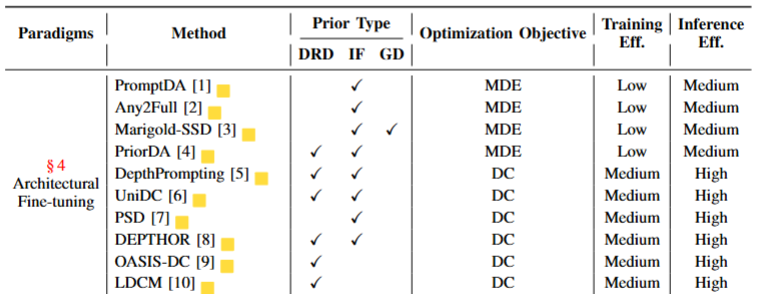 

**Prompting Depth Anything for 4K Resolution Accurate Metric Depth Estimation**:  
论文中提到PromptDA与Depth Prompting的区别是，PromptDA使用网络以稀疏深度作为深度基础模型的提示，实现特定的输出。相反，Depth Prompting将稀疏深度与深度基础模型的特征融合，以对基础模型输出进行后处理，这并不构成提示基础模型   
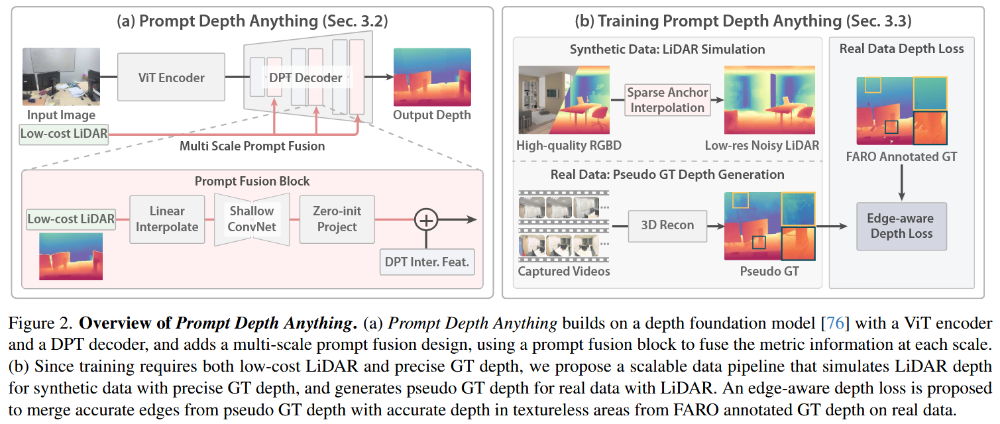 
具体地，对于DPT解码器中的每个尺度Si，首先双线性地调整低分辨率深度图的大小以匹配当前尺度的空间维度。然后，调整大小的深度图通过浅层卷积网络来提取深度特征。之后，使用零初始化卷积层将提取的特征投影到与图像特征Fi相同的维度，最后将深度特征添加到DPT中间特征中进行深度解码

**Any2Full**:  
验证的核心假设：普通MDE（如DA v2）的输出是空间变尺度的，不同区域需要不同的局部尺度因子才能对齐真实深度  
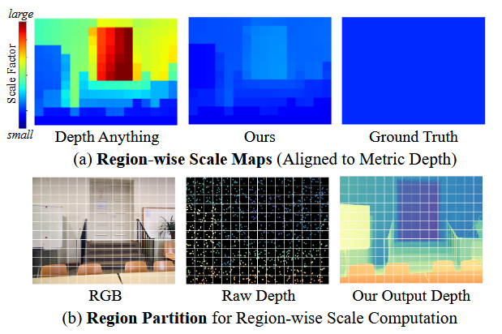 
分析：sk=median(Dgt/Dpred) 不同区域的尺度因子波动巨大（DA v2），红色偏大，蓝色偏小，说明不能直接用全局最小二乘做深度补全  
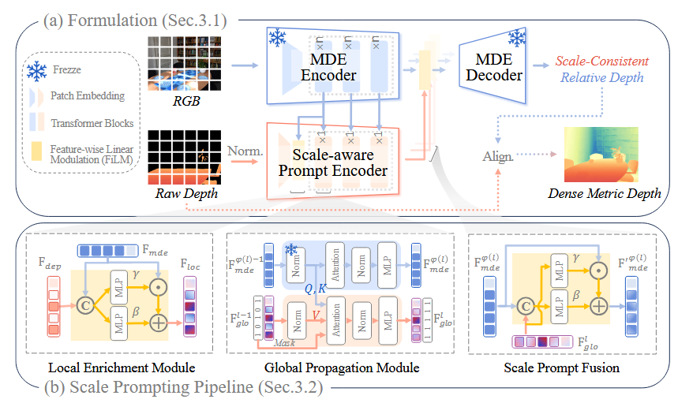 
（1）Local Enrichment Module  
把稀疏深度的尺度线索安全地锚定到MDE的特征空间里，让尺度信息对稀疏度不敏感  
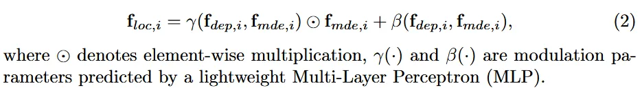 
（2）Global Propagation Module  
把局部零散的尺度线索，沿着图像几何结构扩散到全图，形成全局统一的尺度   
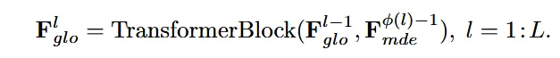 
注意力的Query和Key来自MDE几何特征，Value来自尺度特征，这确保了尺度线索沿着基于RGB的MDE特征定义的几何结构扩散，而不是受到稀疏深度的不规则采样模式的影响   
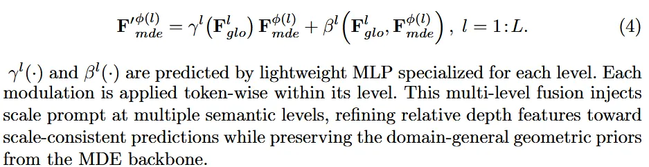 
（3）Scale Prompt Fusion  
把全局尺度提示多层级注入MDE解码器，让MDE输出全局尺度一致的相对深度

**Marigold-SSD**:  
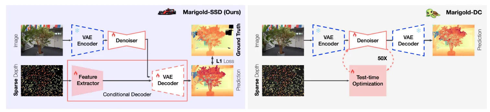 
Marigold-SSD是基于Marigold扩散模型及其变体构建，核心是**单步扩散+后期融合+端到端微调**，将计算负担从推理阶段转移到微调阶段  
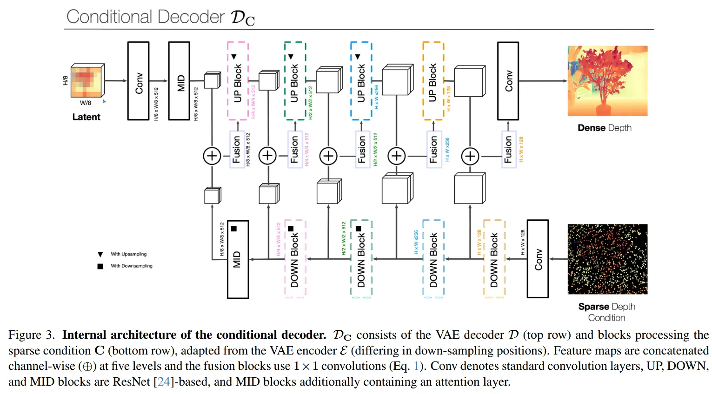 
（1）由VAE解码器和稀疏条件处理分支组成，提取 5 级多尺度特征并通过 1×1 卷积通道级拼接融合  
（2）零卷积层初始化（与Controlnet类似）：初始化时条件分支输出为 0，微调中逐步提升稀疏深度的贡献，有效融入稀疏深度条件

**PriorDA**:  
 
（1）粗度量对齐  
**像素级度量对齐**：用冻结MDE生成相对深度，通过kNN（k=5）逐像素填充缺失区域，保留原始度量与预测几何结构  
**距离感知重加权**：按距离加权优化尺度与偏移，避免深度突变，提升填充平滑度  
**目标**：将各类先验统一为稠密中间域，缩小不同先验的域差距  
（2）精细结构优化  
**条件 MDE 模型**：以预填充先验为度量条件、原始预测为几何条件，修正先验噪声；用DA v2作为主干Encoder-Decoder，在输入层并行增加2个条件卷积分支，用来注入深度先验信息；给度量条件加一个零初始化卷积层，给几何条件加一个零初始化卷积层，这两个卷积层并行于RGB输入层，和RGB特征一起送入Encoder  
**尺度归一化**：将条件归一化至 [0,1]，提升跨场景与跨模型泛化性

**DepthPrompting**:  
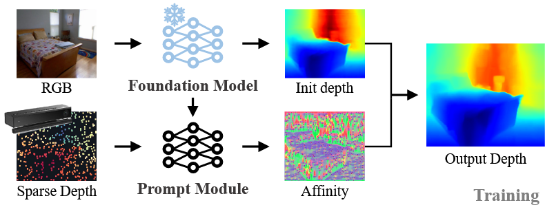 
以冻结的单目深度基础模型（DepthFormer/MiDaS/KBR）为骨干，新增深度提示模块，通过**偏置微调（仅 0.1% 参数）**实现传感器无关深度估计。  
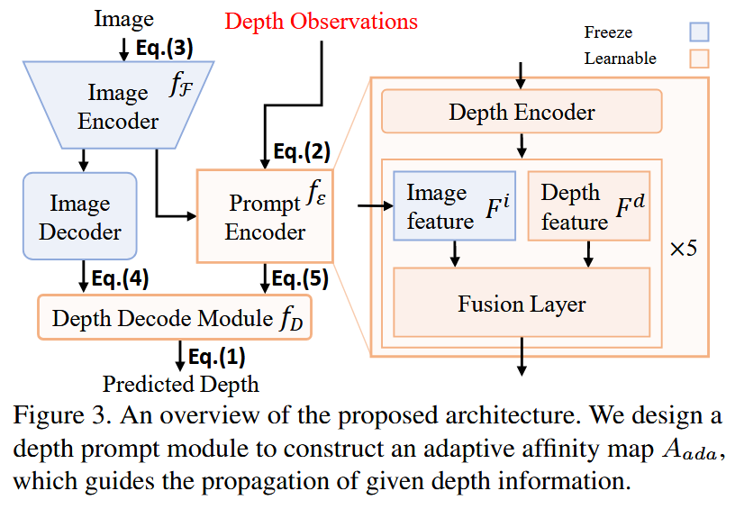 
**深度编码器**：采用ResNet34编码稀疏深度，输出提示嵌入Fd与多尺度深度特征  
**自适应亲和图**：融合深度提示特征与图像特征，生成适配任意稀疏模式的亲和图  
**空间传播**：用自适应亲和图引导稀疏深度扩散，得到稠密深度  

## Date
2026.4.9

### Daily Summary
1. 画完Knowledge Distillation部分的框图
2. 详细阅读Architectural Revision & Training-time Optimization部分的十篇论文
 

**UniDC**:  
本文与DepthPrompting的区别在于，DepthPrompting需要单独训练深度提示编码器，仍存在跨域泛化短板，UniDC则直接复用基础模型特征，并加入双曲几何，在室内→室外、稀疏→极稀疏等跨域场景稳定性更强，1-shot性能提升更显著
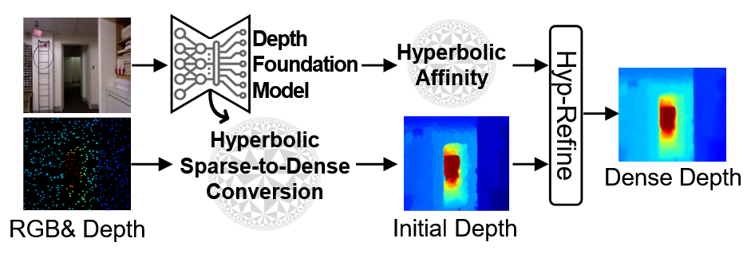 
（1）基础框架（Baseline）  
从基础模型提取深度感知特征→基于特征做稀疏到稠密的转换→用像素级Affinity Map做深度优化  
（2）高级版本（双曲几何增强）  
**多尺度特征融合**：上采样粗特征并与细特征拼接，得到高分辨率上下文特征  
**双曲嵌入**：用指数映射将欧氏特征投影到Poincare球双曲空间，捕捉 3D 数据隐式层级结构  
**自适应曲率生成**：用卷积 + MLP + 全局池化生成场景自适应曲率κ，替代固定曲率  
**双曲稀疏转稠密**：结合双曲距离 + 欧氏距离与双边滤波机制，生成初始稠密深度  
**多曲率双曲空间优化**：设计双曲卷积层HCL，为不同核生成独立曲率，构建多曲率Affinity Map，用CSPN++完成迭代深度优化

**PSD**: 
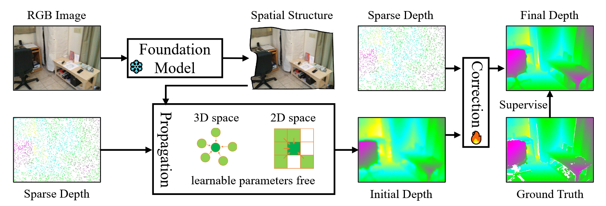 
（1）空间结构线索生成  
用冻结基础模型输出无尺度相对特征，最小二乘法对齐稀疏深度，得到度量深度，相机内参反投影为3D点云，提供空间传播指导  
（2）双空间传播  
**3D欧式空间传播**：基于点云找K近邻，语义特征计算亲和度，保证全局几何结构  
**2D图像空间传播**：8邻域局部传播，保证局部一致性与边缘平滑  
（3）Correction Module  
以残差学习修正基础模型畸变，初始残差估计→残差区间划分→逻辑回归打分→加权求和得最终残差，搭配不确定性监督  
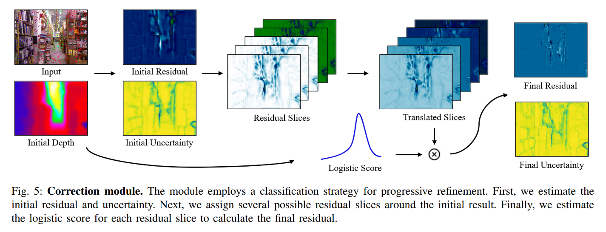 

**DEPTHOR**: 
面向轻量化dToF传感器，将dToF超分问题重构为深度补全  
 
Two-Stage：  
（1）多模态融合阶段：输入RGB + 稀疏深度 + DA v2 逆深度，经过Encoder和Decoder输出Coarse Depth  
（2）融合UNet 特征 + MDE 特征计算混合Affinity Map，基于CSPN++迭代传播，不嵌入原始dToF噪声点
**OASIS-DC**: 
 
Two-stage：  
（1）输入MDE相对深度 + Sparse Depth，输出Initial Depth，残差校正网络输出残差，加上Initial Depth，即为Refine Depth  
（2）双曲亲和优化

**LDCM**: 
 
（1）Poisson基粗深度对齐  
融合稀疏深度与Depth Anything V2 相对深度，生成保结构、保度量的粗深度
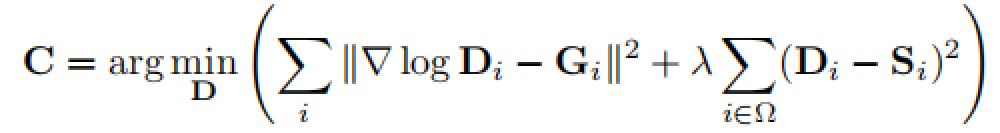 
（2）点云图回归  
放弃传统深度头，直接预测相机空间3D点云P=(X, Y, Z)，最终深度取Z通道，无需相机内参即可获得度量尺度  
**图像编码器**：DINOv2-ViT-B  
**深度编码器**：SPNet-Tiny  
**Fusion**：多尺度残差融合  
**解码器**：DPT Head
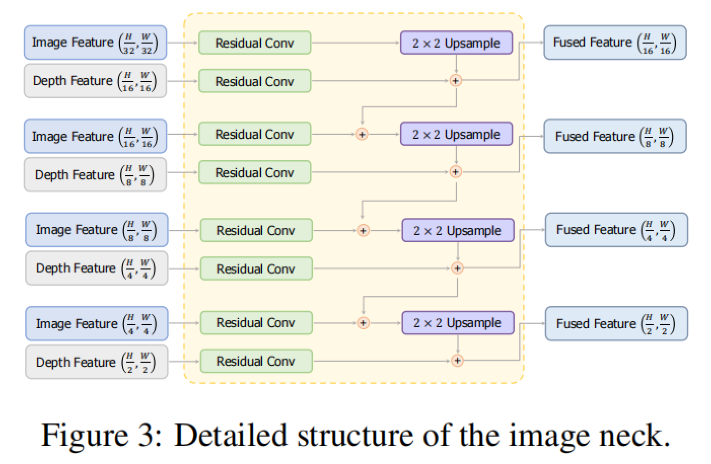 

## Date
2026.4.10

### Daily Summary
1. 画完architectural revision & training-time Optimization部分的框图
2. 看了MTDNet: Text-Guided Diffusion Network for Multi-Task Dense Prediction，我存在以下几个问题：  
（1）Stable Diffusion 1.5的作用：论文中将时间步固定为t=0，等价于SD变成特征提取Backbone，SD强项是迭代去噪逐步生成细节，实际则仅利用其强大的预训练语义编码能力  
（2）Latent grounding的作用是消除文本先验的歧义性，因为同一张图像可能有多种合理的解释，Latent grounding引入了潜空间图像表示作为“视觉证据”。
是否需要一个噪声文本鲁棒性实验，验证“视觉锚定”是否真正起到了“过滤”作用，如果输入的文本包含错误信息，例如图中明明没有椅子，但描述里写了“有椅子”），模型是否会被误导？
如果在文本包含噪声时，性能下降幅度远小于没有“视觉锚定”的模型，这是否能证明模型不是在“盲从”文本，而是在利用图像证据“筛选”文本

## Date
2026.4.11-2026.4.12

### Daily Summary
1. 整理论文中的Loss Functions，写完这个Section
2. 修改Taxonomy的表格
